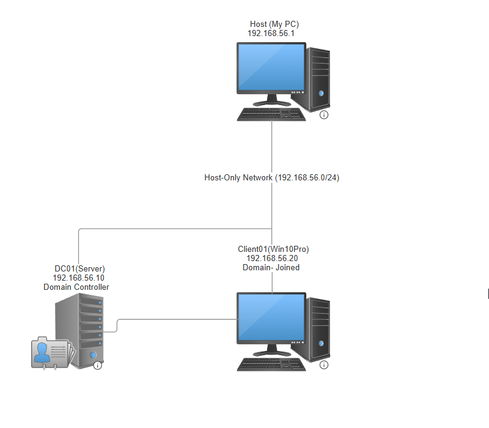

🧪 Active Directory Lab using VirtualBox

📄 Overview
This lab simulates a small enterprise network with an Active Directory Domain Controller (DC), a domain-joined Windows 10 Pro client, All virtual machines are isolated using a VirtualBox host-only network to ensure a safe environment for experimentation.

🖼️ Network Diagram

✅ Prerequisites

Before setting up the lab, install the required software:

1. VirtualBox (Windows/Linux/macOS):https://www.virtualbox.org/wiki/Downloads

2. VirtualBox Extension Pack (enables USB, RDP, etc.):https://www.virtualbox.org/wiki/Downloads

4. Enable Virtualization (VT-x or AMD-V) in BIOS/UEFI:

     -Restart your computer and enter BIOS/UEFI setup (usually by pressing Del, F2, or F10 during boot)
  
     -Find the setting labeled Intel VT-x, Intel Virtualization Technology, or AMD-V
  
     -Enable the setting
  
     -Save and exit BIOS (usually F10)

Ensure your system supports virtualization and that it's turned on. Most modern CPUs support this feature.

✅ Lab Setup Instructions:

Step 1: Configure Host-Only Network in VirtualBox
1. Open VirtualBox → `File → Tools → Network Manager`
2. Ensure VirtualBox Host-Only Ethernet Adapter exists
3. Click the gear icon ⚙️:
   - IPv4 Address: `192.168.56.1`
   - Subnet Mask: `255.255.255.0`
   - Uncheck DHCP Server
4. Save and close      

Step 2: Download Required ISOs
Download the following ISO files before creating your virtual machines:

1. Windows Server 2019/2022 Evaluation:  
   [(https://www.microsoft.com/en-us/evalcenter/evaluate-windows-server)](https://www.microsoft.com/en-us/evalcenter/download-windows-server-2022)

2. Windows 10 Pro Evaluation:  
   [https://www.microsoft.com/en-us/evalcenter/evaluate-windows-10-enterprise](https://www.microsoft.com/en-us/evalcenter/evaluate-windows-10-enterprise)

3. Kali Linux (Optional - Attacker VM):  
   [https://www.kali.org/get-kali/](https://www.kali.org/get-kali/)

Make sure to verify the file integrity with provided checksums if needed.     

Step 3: Install Windows Server (DC01)
1. Create a VM named `DC01`:
   - RAM: 4GB+, CPU: 2 cores, HDD: 60GB
   - Network: Host-Only Adapter → VirtualBox Host-Only Ethernet Adapter
   - Mount Windows Server 2019/2022 ISO
2. Install Windows Server (Standard with Desktop Experience)
3. Set Admin password: `P@ssw0rd!`
4. Rename computer to `DC01` → Reboot
5. Set static IP:
   - IP: `192.168.56.10`
   - Subnet: `255.255.255.0`
   - Gateway: `192.168.56.1`
   - DNS: `192.168.56.10`
6. Verify network access: `ping 192.168.56.1`     

Step 4: Promote DC01 to Domain Controller
1. Open Server Manager → Add Roles and Features
2. Role-based installation → Select `DC01`
3. Check Active Directory Domain Services (AD DS) → Add features
4. Finish and install
5. After install, click blue flag → "Promote this server to a domain controller"
6. Choose: Add new forest → Root domain: `corp.local`
7. Set DSRM password: `P@ssw0rd!` → Accept defaults
8. Complete wizard → Auto reboot
9. Log in with: `CORP\Administrator`
10. Confirm SYSVOL and NETLOGON exist:
    - Run: `\DC01` in File Explorer
    - Or: `net share` in Command Prompt     

Step 5: Install Windows 10 Pro (Client01)

5.1: Create the Windows 10 ISO using Media Creation Tool
If you don't already have a Windows 10 ISO:

1. Download the Media Creation Tool from Microsoft:  
   [https://www.microsoft.com/software-download/windows10](https://www.microsoft.com/software-download/windows10)

2. Launch the tool and choose:
   - "Create installation media (USB flash drive, DVD, or ISO file) for another PC"

3. Select:
   - Language: English (United States)
   - Edition: Windows 10
   - Architecture: 64-bit (x64)

4. Choose ISO file → Save it locally (e.g., `Windows10.iso`)

You can now use this ISO to install Windows 10 Pro in your VM.

5.2: Install Windows 10 Pro in VirtualBox
1. Create VM named `Client01`
   - RAM: 2GB+, HDD: 50GB, Network: Host-Only
   - Mount the ISO created above

2. During setup: Choose "Set up for an organization"
3. Create a local user: `labadmin` with password `P@ssw0rd!`
4. Rename the computer to `Client01` → Restart

5.3: Configure Static IP
1. Set static IP address:
   - IP: `192.168.56.20`
   - Subnet: `255.255.255.0`
   - Gateway: `192.168.56.1`
   - DNS: `192.168.56.10`

2. Confirm connection to DC:
   - Open Command Prompt → `ping dc01` or `ping 192.168.56.10`     

Step 6: Join Client01 to the Domain
1. Open `sysdm.cpl` → Change settings → Join domain: `corp.local`
2. Authenticate with:
   - Username: `Administrator`
   - Password: `P@ssw0rd!`
3. Reboot
4. Log in with domain account: `CORP\Administrator`     

🛠️ STEP 7 – Create Domain Users, OUs, and GPOs

✅ 7.1: Open Active Directory Tools on DC01
Log into DC01 as CORP\Administrator
Open Server Manager → Tools (top-right corner)
Click: Active Directory Users and Computers (ADUC)

✅ 7.2: Create Organizational Units (OUs)
In ADUC, right-click your domain (corp.local) → New → Organizational Unit
Create the following structure:

corp.local
├── Users
├── IT
├── Sales
└── Workstations

OUs help organize users, computers, and apply GPOs logically.

✅ 7.3: Create Domain Users
Method 1: GUI (Simple)
Right-click IT → New → User
Add:
          - First name: Alice
          - Username: alice
          - Password: P@ssw0rd!
          - Uncheck: "User must change password at next logon"
Repeat for:
          - bob (OU: Sales)
          - itadmin (OU: IT, will become Domain Admin later)

Method 2: PowerShell (Faster)
Open PowerShell as Administrator
Run:

New-ADUser -Name "Alice IT" -SamAccountName alice -UserPrincipalName alice@corp.local -AccountPassword (ConvertTo-SecureString "P@ssw0rd!" -AsPlainText -Force) -Enabled $true -Path "OU=IT,DC=corp,DC=local"

New-ADUser -Name "Bob Sales" -SamAccountName bob -UserPrincipalName bob@corp.local -AccountPassword (ConvertTo-SecureString "P@ssw0rd!" -AsPlainText -Force) -Enabled $true -Path "OU=Sales,DC=corp,DC=local"

New-ADUser -Name "ItAdmin" -SamAccountName itadmin -UserPrincipalName itadmin@corp.local -AccountPassword (ConvertTo-SecureString "P@ssw0rd!" -AsPlainText -Force) -Enabled $true -Path "OU=IT,DC=corp,DC=local"

✅ 7.4: Add itadmin to Domain Admins
Useful for simulating a privileged account for BloodHound / attack paths
Open ADUC
Go to: corp.local → Users → Domain Admins
Right-click → Properties → Members → Add
Type: itadmin → OK

✅ 7.5: Move Client Computer to Workstations OU
In ADUC, click corp.local → Computers
Right-click CLIENT01 → Move
Select OU: Workstations → OK

✅ 7.6: Create a Basic GPO (Example: Desktop Wallpaper)
Open Group Policy Management (Server Manager → Tools)
Right-click corp.local or any OU → Create a GPO
Name: Set Desktop Background
Right-click the GPO → Edit
Navigate to:
User Configuration → Administrative Templates → Desktop → Desktop
Double-click Desktop Wallpaper
Set to Enabled
Wallpaper Name: C:\Windows\Web\Wallpaper\Windows\img0.jpg
Style: Fill
Click OK

✅ 7.7: Link the GPO
In Group Policy Management:
Right-click IT OU → Link an existing GPO → Select Set Desktop Background
Now, only users under the IT OU will get this wallpaper policy at login.

✅ 7.8: Force Policy Update on Client01
Log into Client01 as alice
Run: gpupdate /force
Log out and log back in to see wallpaper policy

✅ Lab Ready! Your environment is now a functioning domain with organized users, computers, and policies — ready for blue/red team exercises, enumeration, scripting, and automation.
